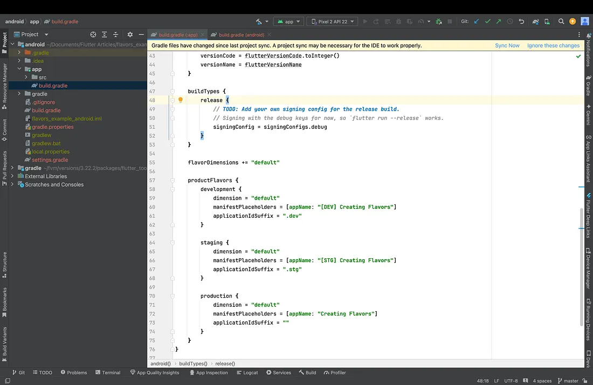
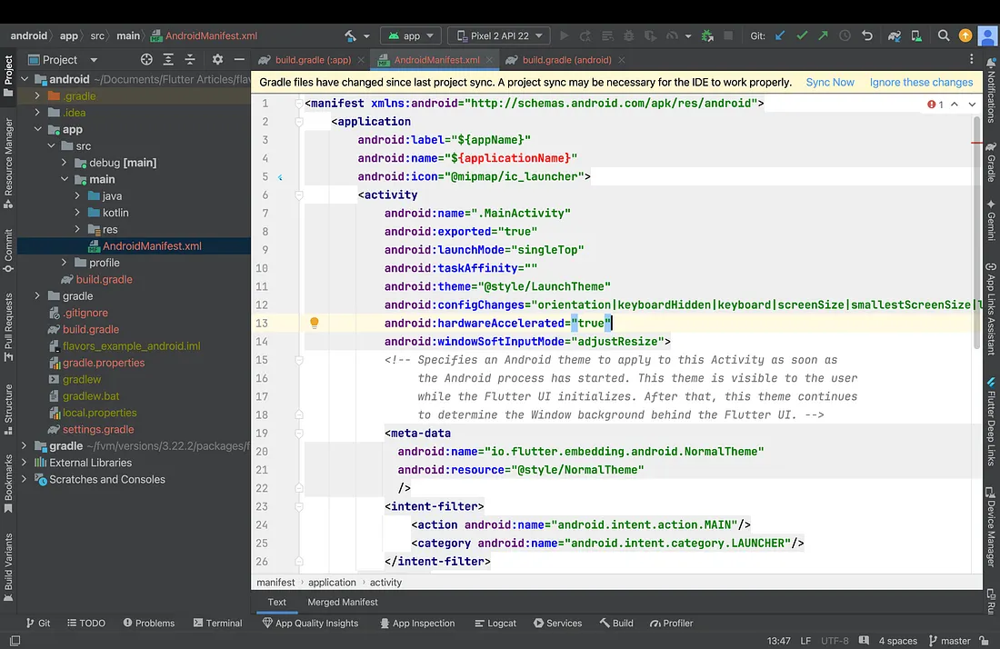

Flutter flavor setup
/// Android Folder
Step 1:  android/app/build.gradle.kts
Expand the app folder and open the build.gradle file. Inside the android block, after buildTypes,
add the following:

flavorDimensions += "default"

    productFlavors {
        development {
            applicationId "com.paras.development" // This is the base applicationId for the development flavor
            dimension = "default"
            manifestPlaceholders = [appName: "development"]

// applicationIdSuffix = ".dev"  // This will append .dev to the applicationId, making it
com.paras.development.dev
}

        staging {
            applicationId "com.paras.staging" //
            dimension = "default"
            manifestPlaceholders = [appName: 'staging']

// applicationIdSuffix = ".stg"
}

        production {
            applicationId "com.paras.movieapp" //
            dimension = "default"
            manifestPlaceholders = [appName: "production"]

// applicationIdSuffix = ""
}
}

Step 2: Modify the AndroidManifest.xml file
Replace the label property with "${appName}".

//// IOS 
